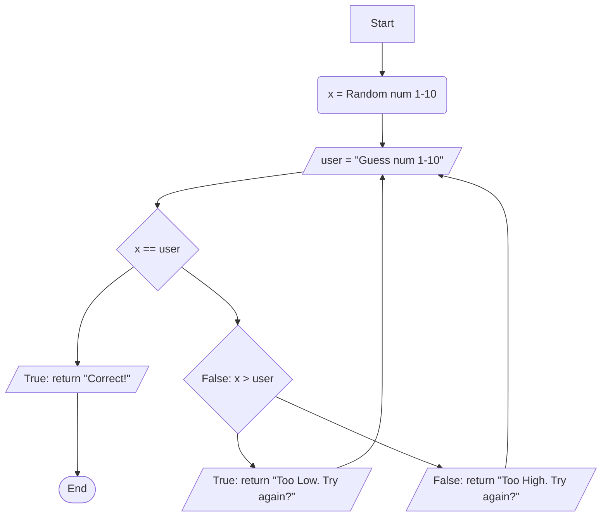

# Flowchart Documentation
1. The program starts
2. The variable "x" is declared and is assigned a random number value between 1 and 10
3. The variable "user" is declared and assigned a user input value
4. x == user is evaluated 
    * If "x" is equal to "user", "Correct!" is returned to the console
        * The program ends
    * If "x" is not equal to "user", x > user is evaluated
        * If "user" is less than "x", "Too Low. Try again?" is returned to the console
            * Return to Step #3
        * If "user" is greater than "x", "Too High. Try again?" is returend to the console
            * Return to Step #3
